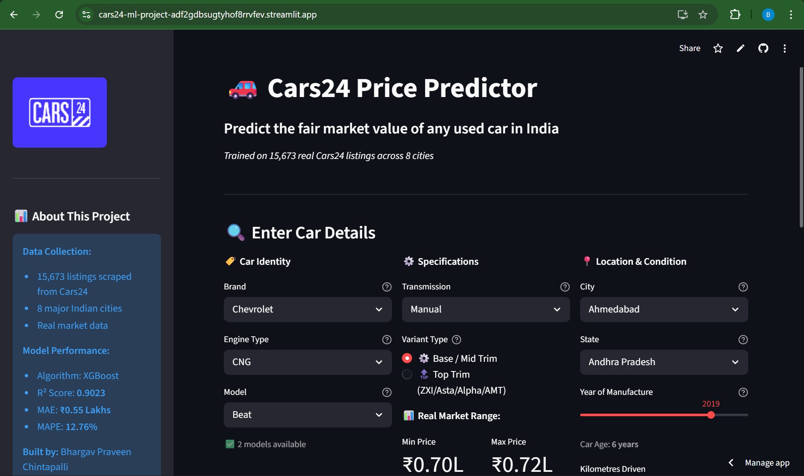

# 🚗 Cars24 Used Car Price Predictor

> A complete end-to-end Machine Learning project that predicts fair market prices for used cars listed on Cars24 across 8 major Indian cities.

🔗 **[Dataset →](https://drive.google.com/file/d/15-Dq1HZN7P907WFWlFWPa7dmbm_mt3Zy/view?usp=sharing)**

---

## 📌 Project Overview

Most used car buyers and sellers don't know the **fair market value** of a car. This project solves that by training an XGBoost model on **15,673 real Cars24 listings** to predict what any used car should realistically cost.

The model achieves an **R² score of 0.9023** — meaning it correctly explains 90.23% of why car prices differ from each other.

---

## 🖥️ Live Demo



🔗 **[Live App →](https://cars24-ml-project-adf2gdbsugtyhof8rrvfev.streamlit.app)** 

Enter any car's details — brand, model, engine type, transmission, city, year and KMs driven — and get an instant fair market price estimate with negotiation range.

---

## 📊 Key Findings From EDA

These are statistically proven insights from the dataset, not assumptions:

| Finding | Detail |
|---|---|
| 🏆 **#1 Price Driver** | Car Age (correlation: **-0.70**) |
| ⛽ **Diesel Premium** | Diesel cars are **₹1.15 Lakhs** more expensive than petrol (p < 0.0001) |
| 🚗 **Automatic Premium** | Automatic cars command **₹2.36 Lakhs** more than manual (p < 0.0001) |
| 🏙️ **Most Expensive City** | Bangalore — avg **₹5.68 Lakhs** |
| 💰 **Most Affordable City** | Gurgaon — avg **₹3.82 Lakhs** |
| 📉 **Depreciation Rate** | Cars lose ₹1.73L from year 1→5, then ₹3.30L more from year 5→10 |
| 🔝 **Top Trim Premium** | Premium variants are **₹1.55 Lakhs** more expensive than base trims (p < 0.0001) |
| 🏷️ **Highest Value Brand** | MG — avg **₹9.95 Lakhs** |
| 📦 **Highest Volume Brand** | Maruti — **4,418 listings** (28% of market) |

---

## 🤖 Model Performance

Three models were trained and compared:

| Model | MAE | MAPE | R² Score |
|---|---|---|---|
| Linear Regression | ₹0.6171L | 14.84% | 0.8712 |
| Random Forest | ₹0.7488L | 17.39% | 0.8321 |
| **XGBoost ✅ Winner** | **₹0.5459L** | **12.76%** | **0.9023** |

> 💡 **Interesting observation:** Linear Regression outperformed Random Forest on R² score (0.87 vs 0.83). This suggests used car pricing follows largely linear depreciation patterns — older age directly and predictably lowers price — which linear models handle efficiently. XGBoost still won overall by capturing non-linear brand-location-age interactions.

### What the metrics mean in plain English:
- **MAE ₹0.55L** → On average, predictions are off by ₹55,000
- **MAPE 12.76%** → Average percentage error per prediction (industry standard: 10–15%)
- **R² 0.9023** → Model explains 90.23% of price variation

---

## 🔍 Feature Importance

Top factors driving used car prices (from Random Forest):

```
Car_Age            ████████████████████████████████  #1 by far
Transmission_Manual████
Model_Creta        ███
Brand_Other        ███
Location_Delhi     ██
Driven_Kms         ██
Engine_Type_Petrol ██
Brand_KIA          █
Brand_MG           █
is_top_trim        █
```

---

## 🗂️ Dataset

| Property | Detail |
|---|---|
| **Source** | Scraped from Cars24.com |
| **Total Records** | 15,673 listings |
| **After Cleaning** | 14,276 records |
| **Cities** | Delhi, Bangalore, Mumbai, Hyderabad, Pune, Chennai, Ahmedabad, Gurgaon |
| **States** | 16 states (extracted from RTO number plates) |
| **Brands** | 16 major brands |
| **Models** | 94 car models |
| **Price Range** | ₹0.27 Lakhs → ₹13.20 Lakhs |
| **Avg Price** | ₹4.77 Lakhs |

### Columns in Raw Dataset
| Column | Description |
|---|---|
| Brand | Car manufacturer |
| Model | Car model name |
| Variant | Trim level |
| Year | Manufacturing year |
| Engine_Type | Petrol / Diesel / CNG / Electric |
| Transmission | Manual / Automatic |
| Driven_Kms | Total kilometres driven |
| EMI_per_Month | Monthly EMI (dropped — data leakage) |
| Price(In_Lakhs) | Listed price — **target variable** |
| Number | RTO registration number |
| Location | City |
| Status | Available / Booked (dropped — irrelevant) |

---

## 🧹 Data Cleaning & Feature Engineering

Key decisions made during cleaning:

```
✅ Dropped EMI_per_Month  → Data leakage (calculated from price)
✅ Dropped Status         → All same value, no predictive power
✅ Extracted State        → From RTO number plate codes (DL→Delhi, KA→Karnataka...)
✅ Created Car_Age        → 2025 - Year (more meaningful than raw year)
✅ Created is_top_trim    → Binary flag from variant names (ZXI, Asta, Alpha...)
✅ Dropped is_BH_series   → Zero variance (all values = 0)
✅ Grouped rare brands    → Brands with <30 listings → "Other"
✅ Grouped rare models    → Models with <30 listings → "Other"
✅ Grouped small states   → States with <50 listings → "Other"
✅ Removed outliers       → IQR method on Price and Driven_Kms
```

---

## ⚙️ Technical Pipeline

```
Raw Data (15,673 rows)
       ↓
Web Scraping (BeautifulSoup)
       ↓
Data Cleaning & Feature Engineering
       ↓
Exploratory Data Analysis
  → 8 visualisations
  → 3 statistical hypothesis tests (t-tests)
  → Outlier detection (IQR method)
       ↓
Data Preparation
  → Log transform on price (fix skewness)
  → One-hot encoding (9 → 136 features)
  → Train-test split (80/20)
  → StandardScaler
       ↓
Model Training
  → Linear Regression
  → Random Forest (200 trees)
  → XGBoost (500 rounds, lr=0.05)
       ↓
Evaluation & Comparison
  → MAE, MAPE, R² Score
       ↓
Streamlit Web App
       ↓
Deployed on Streamlit Cloud ✅
```

---

## 🛠️ Tech Stack

| Category | Tools |
|---|---|
| **Scraping** | BeautifulSoup, Requests |
| **Data Analysis** | Pandas, NumPy |
| **Statistics** | SciPy (t-tests, IQR) |
| **Visualisation** | Matplotlib, Seaborn |
| **Machine Learning** | Scikit-learn, XGBoost |
| **Web App** | Streamlit |
| **Deployment** | Streamlit Cloud |
| **Version Control** | Git, GitHub |

---

## 📁 Repository Structure

```
cars24-price-predictor/
│
├── app.py                  ← Streamlit web application
├── requirements.txt        ← Python dependencies
├── best_model.pkl          ← Trained XGBoost model
├── scaler.pkl              ← Fitted StandardScaler
├── model_columns.pkl       ← 136 feature column names
├── cars24_final.csv        ← Cleaned dataset
│
├── notebooks/
│   ├── 01_data_cleaning.ipynb
│   ├── 02_eda.ipynb
│   ├── 03_feature_engineering.ipynb
│   └── 04_model_training.ipynb
│
└── charts/
    ├── price_distribution.png
    ├── depreciation_curve.png
    ├── petrol_vs_diesel.png
    ├── manual_vs_auto.png
    ├── brand_analysis.png
    ├── city_analysis.png
    ├── correlation_heatmap.png
    └── feature_importance.png
```

---

## 🚀 Run Locally

```bash
# 1. Clone the repo
git clone https://github.com/yourusername/cars24-price-predictor.git

# 2. Go into folder
cd cars24-price-predictor

# 3. Install libraries
pip install -r requirements.txt

# 4. Run the app
streamlit run app.py

# 5. Open in browser
# http://localhost:8501
```

---

## 📈 Statistical Tests Performed

| Test | Variables | Result |
|---|---|---|
| Independent t-test | Petrol vs Diesel prices | Diesel **₹1.15L more** (p < 0.0001) ✅ |
| Independent t-test | Manual vs Automatic prices | Automatic **₹2.36L more** (p < 0.0001) ✅ |
| Independent t-test | Top trim vs Base trim prices | Top trim **₹1.55L more** (p < 0.0001) ✅ |
| Pearson Correlation | Car Age vs Price | **-0.70** (strong negative) ✅ |
| Pearson Correlation | Driven KMs vs Price | **-0.25** (moderate negative) ✅ |
| IQR Outlier Detection | Price + Driven KMs | 635 outliers removed ✅ |

---

## 🔮 Future Improvements

- [ ] Schedule scraper to auto-update data weekly
- [ ] Add OLX / CarDekho price comparison
- [ ] Include car insurance estimate
- [ ] Add price trend chart (how price changed over months)
- [ ] Build price alert system ("notify me when this car drops below ₹X")
- [ ] Add more cities beyond current 8

---

## 👤 About

Built by **BHARGAV PRAVEEN CHINTAPALLI**  
Data Analyst | Python | Machine Learning | SQL

🔗 [LinkedIn](https://www.linkedin.com/in/bhargavchintapalli)  
🔗 [GitHub](https://github.com/BHARGAVPRAVEEN-CHINTAPALLI)  
📧 chintapallibhargavpraveen@gmail.com

---

## ⭐ If you found this useful, please star the repo!
